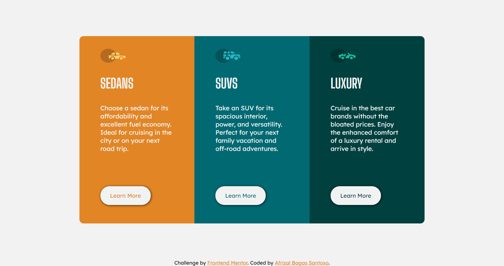

# Frontend Mentor - 3-column preview card component solution

This is a solution to the [3-column preview card component challenge on Frontend Mentor](https://www.frontendmentor.io/challenges/3column-preview-card-component-pH92eAR2-). Frontend Mentor challenges help you improve your coding skills by building realistic projects.

## Table of contents

- [Overview](#overview)
  - [The challenge](#the-challenge)
  - [Screenshot](#screenshot)
  - [Links](#links)
- [My process](#my-process)
  - [Built with](#built-with)
  - [What I learned](#what-i-learned)
  - [Useful resources](#useful-resources)
- [Author](#author)

## Overview

### The challenge

Users should be able to:

- View the optimal layout depending on their device's screen size
- See hover states for interactive elements

### Screenshot

Desktop Version 👇


Mobile Version 👇


### Links

- Solution URL: [Add solution URL here](https://www.frontendmentor.io/solutions/3column-preview-card-component-using-felxbox-and-grid-GFtHq3-0x)
- Live Site URL: [Add live site URL here](https://3-column-preview-card-component-main-gold.vercel.app/)

## My process

### Built with

- Semantic HTML5 markup
- CSS custom properties
- Flexbox
- CSS Grid

### What I learned

im learn how to use flexbox and grid for this project

To see how you can add code snippets, see below:

```css
.container-for-mobile-version {
  display: flex;
  flex-direction: column;
  min-width: 0;
  max-width: 300px;
  height: 100%;
  padding: 30px 0;
}
.container-for-desktop-version {
  display: grid;
  grid-template-columns: repeat(3, 1fr);
  width: 823px;
  height: 446px;
}
```

### Useful resources

- [CSS Grid Guide](https://www.freecodecamp.org/news/css-grid-tutorial-with-cheatsheet/#css-grid-architecture) - This helped me for learn how to apply grid. I really liked this pattern and will use it going forward.

## Author

- Website - [Soon🔜](https://github.com/Afrizalbs)
- Frontend Mentor - [@Afrizalbs](https://www.frontendmentor.io/profile/Afrizalbs)
- Twitter - [@afrizalbagas](https://twitter.com/afrizalbagas)
